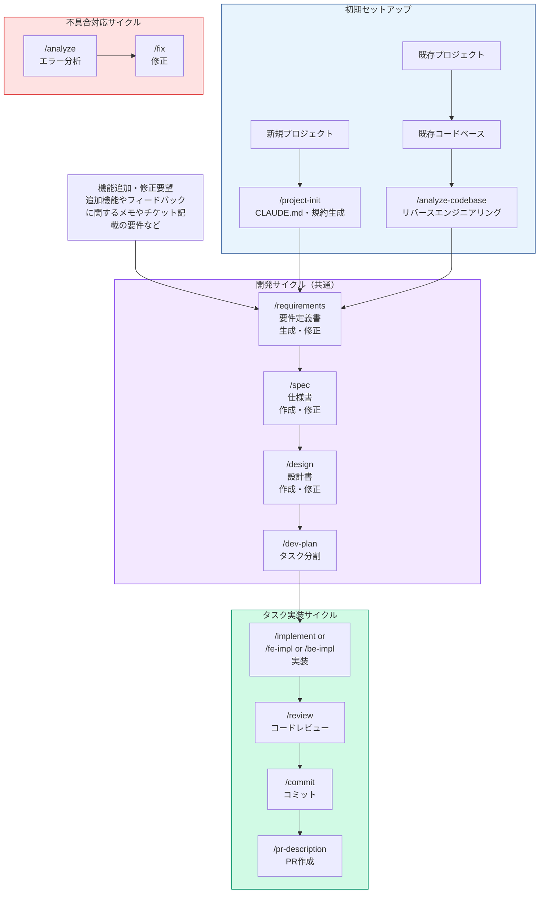
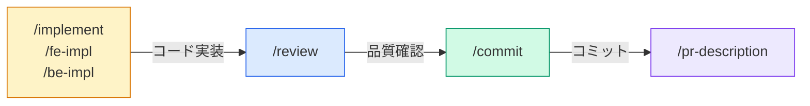
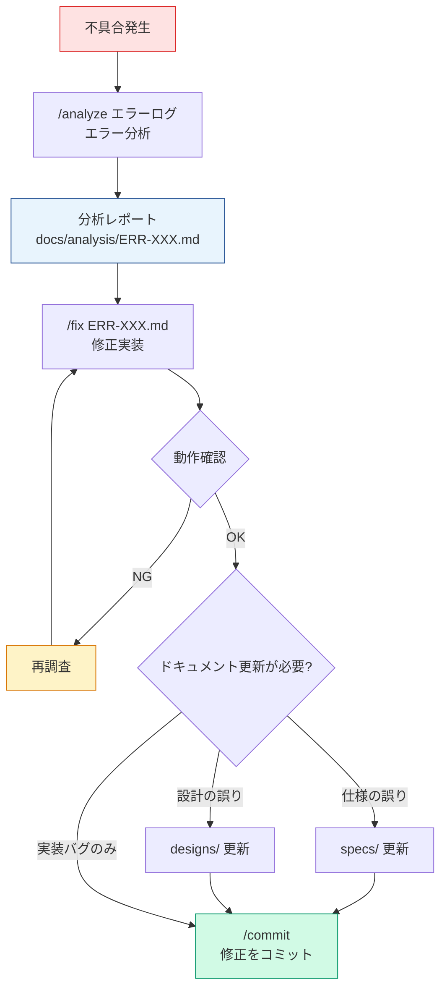

# 開発サイクルガイド

Claude Code Skills を活用したチーム開発ワークフローを定義する。
新規プロジェクトと既存プロジェクトの両方に適用可能。

---

## 全体像

新規開発も既存プロジェクトも、**要件定義 → 仕様 → 設計 → タスク分割 → 実装**の同一サイクルで進む。違いは起点のみ。

開発時に作成される要件定義書・仕様書・設計書（基本的に詳細設計書）は開発資産として継続的に修正などのメンテナンスを行なって管理していく。

- **新規開発:** `/project-init` で初期セットアップ後、要件定義を作成して開始
- **既存プロジェクト:** `/analyze-codebase` でドキュメント基盤を構築した上で、要件定義（機能追加・修正など）から開始

各フェーズの成果物は**レビューサイクル**を経てユーザーの承認を得てから次フェーズに進む。



---

## ドキュメント管理方針

### git管理対象（チーム共有の開発資産）

| ディレクトリ         | 内容       | 生成スキル                                |
| -------------------- | ---------- | ----------------------------------------- |
| `docs/requirements/` | 要件定義書 | `/requirements`                           |
| `docs/specs/`        | 仕様書     | `/spec`, `/analyze-codebase`              |
| `docs/designs/`      | 設計書     | `/design`, `/analyze-codebase`            |
| `docs/knowledge/`    | ナレッジ   | `/implement`, `/fix`, `/analyze-codebase` |

### ローカル運用（実装者 × Claude Codeの作業用）

| ディレクトリ     | 内容               | 生成スキル  |
| ---------------- | ------------------ | ----------- |
| `docs/plans/`    | 開発計画           | `/dev-plan` |
| `docs/tasks/`    | タスクファイル     | `/dev-plan` |
| `docs/analysis/` | エラー分析レポート | `/analyze`  |

チームの進捗管理は外部チケットシステム（Backlog, Jira等）で行う想定。plans/tasks/analysis は `.gitignore` に含め、git管理対象外とする。

---

## 新規プロジェクトへの初期セットアップ

新規プロジェクトでは、最初に `/project-init` で `CLAUDE.md` と規約ファイルの雛形を生成する。これは**初回のみ**実行する。

```
/project-init
```

### 実行内容

1. ヒアリングを通じてプロジェクト情報を収集する
2. テンプレートから `CLAUDE.md` を生成する（不要なセクションは自動削除）
3. 開発スタイルに応じた規約ファイルの雛形を生成する（任意でカスタマイズ可能）
4. `docs/` ディレクトリ構成を作成する

### ヒアリング項目

| グループ | 内容 |
| -------- | ---- |
| プロジェクト基本情報 | 名前・概要・モノレポか否か |
| 技術スタック | FW・言語・DB・パッケージマネージャー等 |
| 開発スタイル | フルスタック（`/implement`）または FE/BE完全分業（`/fe-impl` + `/be-impl`） |
| コミュニケーション | AIへの指示・回答の言語 |

### 生成される規約ファイル

| 開発スタイル | 生成ファイル |
| ------------ | ------------ |
| フルスタック・分業なし | `.claude/skills/implement/conventions.md` |
| FE/BE完全分業 | `.claude/skills/fe-impl/conventions.md` + `.claude/skills/be-impl/conventions.md` |

### セットアップ後のカスタマイズ

生成された `CLAUDE.md` と規約ファイルは雛形のため、内容を確認・編集してから開発を開始する。

| 配置先 | 内容 | 読み込みタイミング |
| ------ | ---- | ------------------ |
| `CLAUDE.md` | プロジェクト全体の共通情報 | 常時 |
| `.claude/rules/*.md` | プロジェクト共通ルール | 常時（全操作で適用） |
| `.claude/skills/implement/conventions.md` | 共通コーディング規約 | `/implement` 実行時 |
| `.claude/skills/fe-impl/conventions.md` | FEコーディング規約 | `/fe-impl` 実行時 |
| `.claude/skills/be-impl/conventions.md` | BEコーディング規約 | `/be-impl` 実行時 |

セットアップ完了後は、`/requirements` から共通の開発サイクルに入る。

---

## 既存プロジェクトへの初期セットアップ

既にコードが存在するプロジェクトでは、最初に `/analyze-codebase` でドキュメント基盤を構築する。これは**初回のみ**実行する。

```
/analyze-codebase
```

### 実行内容

1. コードベースを分析し、仕様書・設計書・ナレッジを生成する
2. `CLAUDE.md` を生成または更新する
3. 開発スタイル（フルスタック / FE/BE完全分業）を確認し、規約ファイルの雛形を生成する
4. テンプレート等その他のカスタマイズ先を案内する（任意）

### セットアップ後のカスタマイズ

| 配置先                                       | 内容                     | 読み込みタイミング         |
| -------------------------------------------- | ------------------------ | -------------------------- |
| `.claude/rules/*.md`                         | プロジェクト共通ルール   | 常時（全操作で適用）       |
| `.claude/skills/implement/conventions.md`    | 共通コーディング規約     | `/implement` 実行時        |
| `.claude/skills/fe-impl/conventions.md`      | FEコーディング規約       | `/fe-impl` 実行時          |
| `.claude/skills/be-impl/conventions.md`      | BEコーディング規約       | `/be-impl` 実行時          |
| `.claude/skills/analyze-codebase/templates/` | ドキュメントテンプレート | `/analyze-codebase` 実行時 |

セットアップ完了後は、機能追加・修正の要件定義（`/requirements`）から共通の開発サイクルに入る。

---

## レビューサイクル（全フェーズ共通）

各ドキュメント生成フェーズ（requirements / spec / design / dev-plan）は、生成後に必ず**レビューサイクル**を経る。ユーザーの承認なしに次フェーズへ進むことはできない。

### ドキュメントステータス

各ドキュメントのヘッダーにステータスを持たせ、レビュー状態を追跡する。

| ステータス    | 意味               | 次フェーズの入力に使えるか |
| ------------- | ------------------ | -------------------------- |
| `📝 ドラフト` | 生成直後・修正中   | **使えない**               |
| `✅ 承認済み` | ユーザーが承認した | **使える**                 |

### レビュープロトコル

各スキルの生成完了後、以下の手順を**必ず**実行する。

#### ステップ1: レビューポイントの提示

生成した内容の要点を箇条書きで提示し、`AskUserQuestion` で承認を求める。

```
📋 <ドキュメント種別>のレビュー
─────────────────────
ファイル: <ファイルパス>

【主要な内容】
- <要点1>
- <要点2>
- <要点3>
（要確認事項がある場合はここに列挙する）

この内容で承認しますか？
```

選択肢:

- **承認する** — ステータスを `✅ 承認済み` に更新し、次ステップを案内する
- **修正を依頼する** — ユーザーのフィードバックを受けて修正する
- **再生成する** — 方針を変えて最初から生成し直す

#### ステップ2: 修正ループ（修正依頼の場合）

1. ユーザーのフィードバック内容を確認する
2. ドキュメントを修正する
3. 修正箇所の差分を提示する
4. 再度 `AskUserQuestion` で承認を求める（ステップ1に戻る）

修正ループは**ユーザーが承認するまで**繰り返す。

#### ステップ3: 承認後の処理

1. ドキュメントのステータスを `✅ 承認済み` に更新する
2. 次のステップのコマンドを案内する

### 入力ゲート

各スキルは実行開始時に、入力ドキュメントのステータスが `✅ 承認済み` であることを確認する。

| スキル                               | 入力ゲート（ステータス確認対象）          |
| ------------------------------------ | ----------------------------------------- |
| `/spec`                              | 要件定義書が `✅ 承認済み` であること     |
| `/design`                            | 仕様書が `✅ 承認済み` であること         |
| `/dev-plan`                          | 仕様書と設計書が `✅ 承認済み` であること |
| `/implement`, `/fe-impl`, `/be-impl` | 開発計画が `✅ 承認済み` であること       |

ステータスが `📝 ドラフト` の場合は、先にレビューを完了するよう案内する。

> **例外:** 事前に用意された既存ドキュメント（手動作成、外部から持ち込み、`/analyze-codebase` で生成など）でステータスヘッダーがない場合は、ユーザーに確認の上、承認済みとして扱ってよい。

---

## 1. 要件定義フェーズ

### 使用コマンド

```
/requirements [テキスト or ファイルパス]
```

### 入力と出力

| 項目 | 内容                                                                               |
| ---- | ---------------------------------------------------------------------------------- |
| 入力 | 新機能のアイディア、修正要望、機能追加の要件（テキスト、ファイル、または対話形式） |
| 出力 | `docs/requirements/<name>-requirements.md`（要件定義書）                           |

新規開発でも既存プロジェクトの機能追加・修正でも、このフェーズから開発サイクルに入る。要件定義書が既に存在する場合はスキップ可能。

**次のステップ:** `/spec` で仕様書を作成・修正する。

---

## 2. 仕様書作成・修正フェーズ

### 使用コマンド

```
/spec docs/requirements/<name>-requirements.md
```

### 入力と出力

| 項目 | 内容                                  |
| ---- | ------------------------------------- |
| 入力 | `docs/requirements/` 配下の要件定義書 |
| 出力 | `docs/specs/<name>-spec.md`（仕様書） |

要件定義書の**機能全体**を1ファイルの仕様書にまとめる。画面仕様・API仕様・データモデルを具体的に記述する。既存の仕様書がある場合は修正・追記する。

---

## 3. 詳細設計作成・修正フェーズ

### 使用コマンド

```
/design docs/specs/<name>-spec.md
```

### 入力と出力

| 項目 | 内容                                                    |
| ---- | ------------------------------------------------------- |
| 入力 | `docs/specs/` 配下の仕様書                              |
| 参照 | `docs/requirements/` 配下の対応する要件定義書も参照する |
| 出力 | `docs/designs/<name>-design.md`（設計書）               |

仕様書の**機能全体**を1ファイルの設計書にまとめる。ファイルパス・コンポーネント名・関数名・実装順序を具体的に記述する。既存の設計書がある場合は修正・追記する。

> **注意:** DB設計にはスキーマのコピーを埋め込まず、スキーマファイル（`prisma/schema.prisma` 等）への参照リンクのみを記載する。

---

## 4. タスク分割フェーズ

### 使用コマンド

```
/dev-plan docs/requirements/<name>-requirements.md
```

### 入力と出力

| 項目 | 内容                                                                                  |
| ---- | ------------------------------------------------------------------------------------- |
| 入力 | 要件定義書（+ 対応する仕様書・設計書を自動参照）                                      |
| 出力 | `docs/plans/<plan-name>.md`（開発計画）、`docs/tasks/TASK-XXX.md`（タスクファイル群） |

**仕様書と設計書を基に**最適なタスク粒度で分割する。設計書の実装順序がタスク分割の基盤となる。

> plans, tasks はローカル運用（git管理対象外）。外部チケットIDがある場合はそれをタスクIDとして使用可能。

### タスクのステータス管理

各プランファイル内のタスク一覧でステータスを追跡する（ローカル）。

| ステータス | 意味           | 更新タイミング             |
| ---------- | -------------- | -------------------------- |
| ⬜ 未着手  | タスク作成直後 | `/dev-plan` 実行時         |
| 🔨 実装中  | 実装作業中     | `/implement` 実行時        |
| ✅ 完了    | コミット完了   | git commit 実行後に手動更新 |

---

## 5. タスク実装サイクル

タスクごとに以下のステップを順に実行する。



### 5.1 実装

**基本コマンド（推奨）:**

```
/implement TASK-XXX
```

FE・BE・フルスタックを問わず、これが基本の実装コマンド。
`conventions.md` が存在すればFE/BEそれぞれのファイル種別に応じて規約を適用する。

**完全分業チーム向けオプション:**

```
/fe-impl TASK-XXX       # FE担当者専用（fe-impl/conventions.md を参照）
/be-impl TASK-XXX       # BE担当者専用（be-impl/conventions.md を参照）
```

FE担当・BE担当が明確に分かれているチームのみ使用する。フルスタック開発や分業なしのチームは `/implement` を使う。

設計書に**厳密に**従って実装する。タスクファイルのスコープと完了条件に沿って、設計書の該当部分を実装する。

**実装ルール（厳守）:**

- 設計書のファイルパス・コンポーネント名・関数名をそのまま使う
- 設計書にないファイル・機能を勝手に追加しない
- 各ステップでビルド・リントを確認する
- 設計と異なる判断が必要な場合は**止まってユーザーに確認する**

**設計書との差異が発生した場合:**

1. **実装を一旦止める**
2. 何が問題で、どう変更すべきかをユーザーに報告する
3. ユーザーの承認を得てから変更する
4. `docs/designs/` の該当設計書に変更を反映する
5. 必要であれば `docs/specs/` の該当仕様書も更新する

**ナレッジの蓄積:**

実装中に以下のような知見が得られた場合、`docs/knowledge/` にMarkdownファイルとして記録する。

- 環境固有の制約や回避策
- パッケージの互換性問題や注意点
- ビルド・リント時のハマりどころと解決策
- 設計書にない実装上のTips

### 5.2 コードレビュー（/review）

```
/review             # 現在のブランチの変更をレビュー
/review TASK-XXX    # タスクスコープに沿ったレビュー
```

3つのサブエージェントを並列実行し、コード品質・設計整合性・変更影響を分析する。

### 5.3 コミット（/commit）

```
/commit
```

- 変更内容からコミットメッセージを生成して提示する
- git操作はユーザーが自分で実行する
- タスク完了の場合は該当プランのステータス更新を案内する（ローカル）

### 5.4 PR作成（/pr-description）

```
/pr-description
```

- ブランチの変更内容からPRタイトル・本文を生成
- 関連するタスク・設計書へのリンクを含める

---

## 6. 不具合対応サイクル

不具合が発生した場合は、分析→修正→確認→ドキュメント更新のサイクルで対応する。



### 6.1 エラー分析（/analyze）

```
/analyze [エラーログやバグの説明]
```

- エラー内容、原因、修正方針を分析
- `docs/analysis/ERR-XXX.md` にレポートを生成（ローカル運用）
- レポートは `/fix` の入力としてそのまま使える

### 6.2 修正（/fix）

```
/fix docs/analysis/ERR-XXX.md
/fix [問題の説明]
```

**修正フロー:**

1. 原因特定（分析レポートがあれば読み込む）
2. 修正方針をユーザーに提示 → 承認
3. 修正を実装
4. 動作確認（ビルド・リント + 問題の再現確認）
5. **NGなら再調査に戻る**
6. OKならドキュメント更新（仕様・設計に影響がある場合のみ）
7. 修正で得た知見があれば `docs/knowledge/` に記録する

### 6.3 ドキュメント更新の判断基準

| 不具合の原因                   | specs/ | designs/         |
| ------------------------------ | ------ | ---------------- |
| 仕様の誤り・漏れ               | 更新   | 必要に応じて更新 |
| 設計の誤り                     | -      | 更新             |
| 実装バグ（仕様・設計は正しい） | -      | -                |
| 新しいエッジケースの発見       | 追記   | 必要に応じて追記 |

ドキュメント更新時は、更新箇所に以下のコメントを残す。

```markdown
<!-- fix: YYYY-MM-DD [修正内容の要約] -->
```

---

## 7. コマンド一覧

### ドキュメント生成

| コマンド            | 用途                             | 主な出力                                |
| ------------------- | -------------------------------- | --------------------------------------- |
| `/project-init`     | 新規PJ初期セットアップ           | CLAUDE.md, conventions.md, docs/        |
| `/analyze-codebase` | 既存コード分析・ドキュメント生成 | specs/, designs/, knowledge/, CLAUDE.md |
| `/requirements`     | 要件定義書生成                   | requirements/\<name\>-requirements.md   |
| `/spec`             | 仕様書生成                       | specs/\<name\>-spec.md                  |
| `/design`           | 詳細設計書生成                   | designs/\<name\>-design.md              |
| `/dev-plan`         | タスク分割・開発計画             | plans/, tasks/（ローカル）              |

### 実装・レビュー

| コマンド              | 用途             | 備考                               |
| --------------------- | ---------------- | ---------------------------------- |
| `/implement TASK-XXX` | 設計に従い実装   | **基本コマンド**。FE/BE/フルスタック対応 |
| `/fe-impl TASK-XXX`   | FE専任実装       | 完全分業チームのFE担当者向け       |
| `/be-impl TASK-XXX`   | BE専任実装       | 完全分業チームのBE担当者向け       |
| `/review`             | コードレビュー   | 3エージェント並列実行              |
| `/commit`             | コミットメッセージ生成 | git操作はユーザーが実行           |
| `/pr-description`     | PR概要生成       | タイトル・本文を生成               |

### 不具合対応

| コマンド   | 用途                   | 主な出力                        |
| ---------- | ---------------------- | ------------------------------- |
| `/analyze` | エラー分析             | analysis/ERR-XXX.md（ローカル） |
| `/fix`     | 修正・ドキュメント更新 | 修正コード, ドキュメント更新    |

---

## 8. 運用ルール

### やってよいこと

- タスクの順序を依存関係に従って入れ替える
- 仕様の「要確認事項」を解消してから設計に進む
- 実装中に設計の問題を発見したらユーザーに確認してドキュメントを更新する
- 外部チケットIDをタスクIDとして使用する

### やってはいけないこと

- 仕様書なしで設計に進む（`/spec` → `/design` の順序を守る）
- 設計書なしでタスク分割に進む（`/design` → `/dev-plan` の順序を守る）
- タスク分割なしで実装に進む（`/dev-plan` → `/implement` の順序を守る）
- **ドラフト状態のドキュメントを入力として次フェーズに進む**（レビューサイクルで承認を得ること）
- **レビューの承認確認をスキップする**（`AskUserQuestion` による確認は省略不可）
- 設計書にないファイルや機能を勝手に実装する
- 動作確認をスキップする
- ドキュメントを更新せずに仕様・設計と異なる実装を残す
- DB設計にスキーマのコピーを埋め込む（参照リンクのみ）
