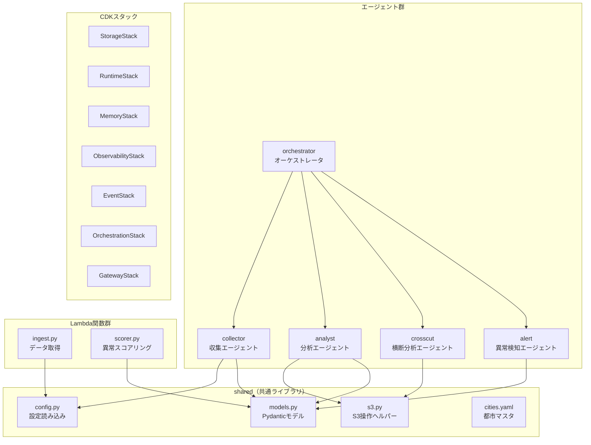
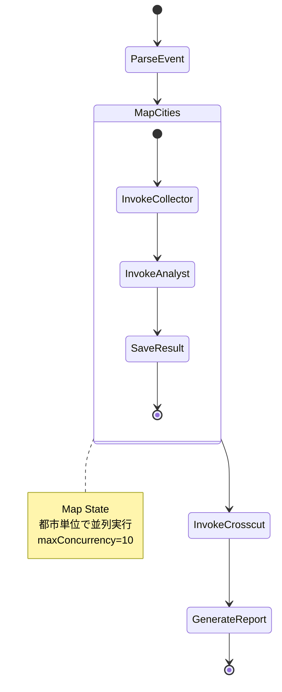

# 天気データ分析AIエージェント 詳細設計書

**仕様書:** [weather-agent-spec.md](../specs/weather-agent-spec.md)
**作成日:** 2026-03-21
**ステータス:** ✅ 承認済み

---

## 1. ディレクトリ構成

```
/
├── packages/
│   ├── agents/                          # エージェント群（Python / uv）
│   │   ├── pyproject.toml               # ワークスペースルート
│   │   ├── shared/                      # 共通ライブラリ
│   │   │   ├── pyproject.toml
│   │   │   └── src/
│   │   │       └── shared/
│   │   │           ├── __init__.py
│   │   │           ├── config.py        # 設定ファイル読み込み（cities.yaml等）
│   │   │           ├── models.py        # 共通データモデル（Pydantic）
│   │   │           ├── s3.py            # S3ヘルパー
│   │   │           └── cities.yaml      # 都市マスタ
│   │   │
│   │   ├── collector/                   # Step 1: 収集エージェント
│   │   │   ├── pyproject.toml
│   │   │   ├── README.md                # 学習ガイド
│   │   │   └── src/
│   │   │       └── collector/
│   │   │           ├── __init__.py
│   │   │           ├── __main__.py      # CLI エントリポイント
│   │   │           ├── agent.py         # エージェント定義
│   │   │           └── tools/
│   │   │               ├── __init__.py
│   │   │               ├── weather.py   # get_weather ツール
│   │   │               └── disaster.py  # get_disaster_info ツール
│   │   │
│   │   ├── analyst/                     # Step 2: 分析エージェント
│   │   │   ├── pyproject.toml
│   │   │   ├── README.md
│   │   │   └── src/
│   │   │       └── analyst/
│   │   │           ├── __init__.py
│   │   │           ├── __main__.py
│   │   │           ├── agent.py
│   │   │           └── tools/
│   │   │               ├── __init__.py
│   │   │               └── save_to_s3.py
│   │   │
│   │   ├── crosscut/                    # Step 3: 横断分析エージェント
│   │   │   ├── pyproject.toml
│   │   │   ├── README.md
│   │   │   └── src/
│   │   │       └── crosscut/
│   │   │           ├── __init__.py
│   │   │           ├── __main__.py
│   │   │           └── agent.py
│   │   │
│   │   ├── alert/                       # Step 3: 異常検知エージェント
│   │   │   ├── pyproject.toml
│   │   │   ├── README.md
│   │   │   └── src/
│   │   │       └── alert/
│   │   │           ├── __init__.py
│   │   │           ├── __main__.py
│   │   │           └── agent.py
│   │   │
│   │   ├── orchestrator/                # Step 3: オーケストレータ
│   │   │   ├── pyproject.toml
│   │   │   ├── README.md
│   │   │   └── src/
│   │   │       └── orchestrator/
│   │   │           ├── __init__.py
│   │   │           ├── __main__.py
│   │   │           └── agent.py
│   │   │
│   │   └── lambdas/                     # Step 7: Lambda関数群
│   │       ├── pyproject.toml
│   │       └── src/
│   │           └── lambdas/
│   │               ├── __init__.py
│   │               ├── ingest.py        # データ取得Lambda
│   │               └── scorer.py        # 異常気象スコアリングLambda
│   │
│   └── infra/                           # AWS CDK（TypeScript）
│       ├── package.json
│       ├── tsconfig.json
│       ├── cdk.json
│       ├── bin/
│       │   └── app.ts                   # CDKアプリエントリポイント
│       └── lib/
│           ├── storage-stack.ts         # Step 2: S3
│           ├── runtime-stack.ts         # Step 4: AgentCore Runtime
│           ├── memory-stack.ts          # Step 5: AgentCore Memory
│           ├── observability-stack.ts   # Step 6: CloudWatch
│           ├── event-stack.ts           # Step 7: EventBridge + Lambda
│           ├── orchestration-stack.ts   # Step 8: Step Functions
│           └── gateway-stack.ts         # Step 9: Gateway + Guardrails + 通知
│
├── docs/
│   ├── requirements/
│   │   └── weather-agent-requirements.md
│   ├── specs/
│   │   └── weather-agent-spec.md
│   ├── designs/
│   │   ├── weather-agent-design.md      # 本ファイル
│   │   ├── sample-architecture.drawio
│   │   └── architecture-comparison.md
│   └── knowledge/
│       ├── architecture.drawio
│       └── agent-core-lab.drawio.xml
│
├── CLAUDE.md
└── .gitignore
```

---

## 2. コンポーネント設計

### コンポーネント階層図



---

## 3. Step 1: 収集エージェント 詳細設計

> **学習ポイント（Lab 1 対応）:**
> Strands Agents SDK の基本を学ぶ最初のステップ。`Agent` / `@tool` / Bedrock連携の3要素を理解する。
>
> **実装で学ぶこと:**
> - `@tool` デコレータの引数型ヒントがBedrockに渡されるツールスキーマになる仕組み
> - `httpx` による非同期HTTP通信とエラーハンドリング
> - Pydanticモデルでレスポンスを型安全にパースする方法

### 3.1 shared/config.py

```python
"""設定ファイル読み込みモジュール。

学習ポイント:
    cities.yaml を読み込み、都市情報を提供する。
    本番構成ではDBから取得するが、サンプルではYAMLファイルで管理。
"""
from __future__ import annotations

from dataclasses import dataclass
from pathlib import Path

import yaml


@dataclass(frozen=True)
class CityConfig:
    name: str
    name_en: str
    latitude: float
    longitude: float
    timezone: str


def load_cities() -> list[CityConfig]:
    """cities.yaml から都市一覧を読み込む。"""
    yaml_path = Path(__file__).parent / "cities.yaml"
    with open(yaml_path) as f:
        data = yaml.safe_load(f)
    return [CityConfig(**city) for city in data["cities"]]


def find_city(name: str) -> CityConfig | None:
    """都市名（日本語）で検索する。見つからなければNone。"""
    cities = load_cities()
    return next((c for c in cities if c.name == name), None)
```

### 3.2 shared/models.py

```python
"""共通データモデル。

学習ポイント:
    Pydanticモデルでデータの型を明示することで、
    エージェント間のデータ受け渡しやS3保存時の整合性を担保する。
"""
from __future__ import annotations

from datetime import date
from pydantic import BaseModel


class DailyWeather(BaseModel):
    date: date
    temperature_max: float
    temperature_min: float
    precipitation_sum: float
    wind_speed_max: float
    weather_code: int


class WeatherData(BaseModel):
    city: str
    fetched_at: str
    daily: list[DailyWeather]


class DisasterInfo(BaseModel):
    region: str
    alerts: list[DisasterAlert]


class DisasterAlert(BaseModel):
    type: str          # "大雨警報", "暴風警報" 等
    issued_at: str
    target_area: str
    severity: str      # "warning" or "critical"


class AnalysisAlert(BaseModel):
    alert_id: str
    timestamp: str
    city: str
    type: str          # "temperature_change", "strong_wind", "heavy_rain", "disaster"
    severity: str      # "critical", "warning", "info"
    message: str
    data: dict
```

### 3.3 collector/tools/weather.py

```python
"""天気データ取得ツール。

学習ポイント:
    @tool デコレータで関数をツール化する。
    引数の型ヒント（city: str, days: int）がそのままBedrockに渡される
    ツールパラメータスキーマになる。docstringがツールの説明文になる。
    (Lab 1: Code Interpreter で学んだツール定義パターン)
"""
from __future__ import annotations

import httpx
from strands import tool

from shared.config import find_city
from shared.models import DailyWeather, WeatherData

OPEN_METEO_BASE = "https://api.open-meteo.com/v1/forecast"
GEOCODING_BASE = "https://geocoding-api.open-meteo.com/v1/search"


@tool
def get_weather(city: str, days: int = 7, data_type: str = "forecast") -> str:
    """指定都市の天気データを取得する。

    Args:
        city: 都市名（日本語。例: 東京、大阪）
        days: 取得日数（1〜16、デフォルト7日間）
        data_type: "forecast"（予報）or "historical"（過去データ）
    """
    # 都市名 → 緯度経度の解決
    city_config = find_city(city)
    if city_config:
        lat, lon = city_config.latitude, city_config.longitude
    else:
        # cities.yaml にない場合はGeocoding APIで検索
        coords = _geocode(city)
        if coords is None:
            return f"エラー: 都市名「{city}」が見つかりませんでした。正しい都市名を指定してください。"
        lat, lon = coords

    # Open-Meteo API 呼び出し
    params = {
        "latitude": lat,
        "longitude": lon,
        "daily": "temperature_2m_max,temperature_2m_min,precipitation_sum,wind_speed_10m_max,weather_code",
        "timezone": "Asia/Tokyo",
        "forecast_days": min(days, 16),
    }

    # 仕様書: API通信エラー → リトライ1回、失敗時はエラーメッセージを返す
    response = _fetch_with_retry(OPEN_METEO_BASE, params)
    if response is None:
        return "エラー: 天気データの取得に失敗しました。しばらく待ってから再試行してください。"

    data = response.json()
    daily = data.get("daily", {})

    weather_data = WeatherData(
        city=city,
        fetched_at=data.get("current_weather", {}).get("time", ""),
        daily=[
            DailyWeather(
                date=d,
                temperature_max=tmax,
                temperature_min=tmin,
                precipitation_sum=prec,
                wind_speed_max=wind,
                weather_code=wc,
            )
            for d, tmax, tmin, prec, wind, wc in zip(
                daily["time"],
                daily["temperature_2m_max"],
                daily["temperature_2m_min"],
                daily["precipitation_sum"],
                daily["wind_speed_10m_max"],
                daily["weather_code"],
            )
        ],
    )

    return weather_data.model_dump_json(indent=2)


def _geocode(city: str) -> tuple[float, float] | None:
    """Geocoding APIで都市名を緯度経度に変換する。"""
    try:
        with httpx.Client(timeout=5.0) as client:
            response = client.get(
                GEOCODING_BASE,
                params={"name": city, "count": 1, "language": "ja"},
            )
            response.raise_for_status()
            results = response.json().get("results", [])
            if results:
                return results[0]["latitude"], results[0]["longitude"]
    except httpx.HTTPError:
        pass
    return None


def _fetch_with_retry(
    url: str, params: dict, max_retries: int = 1
) -> httpx.Response | None:
    """HTTP GETリクエストをリトライ付きで実行する。

    仕様書の要件:
        5秒タイムアウト、1回リトライ。失敗時は None を返す。
    """
    for attempt in range(1 + max_retries):
        try:
            with httpx.Client(timeout=5.0) as client:
                response = client.get(url, params=params)
                response.raise_for_status()
                return response
        except httpx.HTTPError:
            if attempt == max_retries:
                return None
    return None
```

<!-- implement: 2026-03-22 TASK-002 リトライ付きHTTPヘルパー(_fetch_with_retry)を追加、エラーハンドリングを仕様書準拠に更新 -->

### 3.4 collector/agent.py

```python
"""収集エージェント定義。

学習ポイント:
    Agent クラスの初期化パターン。
    system_prompt でエージェントの役割を定義し、
    tools で利用可能なツールのリストを渡す。
    Bedrock (Claude) が推論し、必要なツールを自動選択して実行する。
    (Lab 1 対応)
"""
from __future__ import annotations

from strands import Agent

from collector.tools.weather import get_weather
from collector.tools.disaster import get_disaster_info

SYSTEM_PROMPT = """\
あなたは気象データ収集の専門家です。
ユーザーの指示に基づいて、天気データや災害情報を取得し、わかりやすく整理して報告します。

利用可能なツール:
- get_weather: 指定都市の天気予報・過去データを取得
- get_disaster_info: 災害警報・注意報を取得

回答のルール:
- データは必ずツールを使って取得すること（推測しない）
- 取得したデータは表形式で見やすく整理すること
- 温度は摂氏、風速はm/sで表示すること
"""


def create_collector_agent() -> Agent:
    """収集エージェントを生成する。"""
    return Agent(
        system_prompt=SYSTEM_PROMPT,
        tools=[get_weather, get_disaster_info],
    )
```

### 3.5 collector/__main__.py

```python
"""CLI エントリポイント。

学習ポイント:
    uv run python -m collector で起動する。
    agent(user_input) を呼ぶだけで、推論→ツール実行→回答生成が自動で回る。
"""
from __future__ import annotations

from collector.agent import create_collector_agent


def main() -> None:
    agent = create_collector_agent()
    print("🌤 収集エージェント起動（exitで終了）")
    print("=" * 50)

    while True:
        try:
            user_input = input("\nあなた: ").strip()
            if user_input.lower() in ("exit", "quit"):
                break
            if not user_input:
                continue

            # agent() を呼ぶだけでBedrock推論→ツール実行→回答生成が自動で行われる
            response = agent(user_input)
            print(f"\nエージェント: {response}")

        except KeyboardInterrupt:
            break

    print("\n👋 終了します")


if __name__ == "__main__":
    main()
```

---

## 4. Step 2: 分析エージェント 詳細設計

> **学習ポイント（Lab 1 対応）:**
> Code Interpreter をツールとして渡すだけで、LLMがPythonコードを自動生成・実行する。
> 自作ツール `save_to_s3` との組み合わせで「分析→保存」のパイプラインを構築する。

### 4.1 shared/s3.py

```python
"""S3操作ヘルパー。

学習ポイント:
    boto3 の S3 クライアントをラップし、エージェントのツールから簡単に使えるようにする。
    バケット名は環境変数から取得する（CDKデプロイ時に設定される）。
"""
from __future__ import annotations

import os
import boto3


def get_bucket_name() -> str:
    return os.environ.get("WEATHER_AGENT_BUCKET", "weather-agent-dev")


def put_object(key: str, body: str | bytes, content_type: str = "application/json") -> str:
    """S3にオブジェクトを保存し、S3 URIを返す。"""
    bucket = get_bucket_name()
    s3 = boto3.client("s3")
    s3.put_object(Bucket=bucket, Key=key, Body=body, ContentType=content_type)
    return f"s3://{bucket}/{key}"


def get_object(key: str) -> bytes:
    """S3からオブジェクトを取得する。"""
    bucket = get_bucket_name()
    s3 = boto3.client("s3")
    response = s3.get_object(Bucket=bucket, Key=key)
    return response["Body"].read()
```

### 4.2 analyst/tools/save_to_s3.py

```python
"""S3保存ツール。

学習ポイント:
    自作ツールの例。@tool デコレータで定義するだけで
    Bedrockが「分析結果をS3に保存して」という指示を理解し、
    このツールを自動的に呼び出す。
"""
from __future__ import annotations

from strands import tool

from shared.s3 import put_object


@tool
def save_to_s3(content: str, s3_key: str, content_type: str = "application/json") -> str:
    """分析結果をS3に保存する。

    Args:
        content: 保存する内容（テキストまたはJSON文字列）
        s3_key: S3のキー（例: reports/2026-03-21/東京/report.html）
        content_type: MIMEタイプ（デフォルト: application/json）
    """
    uri = put_object(key=s3_key, body=content, content_type=content_type)
    return f"保存完了: {uri}"
```

### 4.3 analyst/agent.py

<!-- implement: 2026-03-22 TASK-004 code_interpreterのインポートパスを実際のパッケージ構造に合わせて修正 -->

```python
"""分析エージェント定義。

学習ポイント:
    Code Interpreter は strands_tools パッケージの AgentCoreCodeInterpreter を使う。
    インスタンスを生成し、.code_interpreter 属性をツールとしてエージェントに渡す。
    (Lab 1: Code Interpreter 対応)

本番構成との違い:
    本番では財務データの分析だが、分析パターン（時系列・比較）は同じ。
"""
from __future__ import annotations

from strands import Agent
from strands_tools.code_interpreter import AgentCoreCodeInterpreter

from analyst.tools.save_to_s3 import save_to_s3

SYSTEM_PROMPT = """\
あなたは気象データ分析の専門家です。
天気データを受け取り、統計分析・可視化・レポート生成を行います。

利用可能なツール:
- code_interpreter: Pythonコードを実行して分析・グラフ生成
- save_to_s3: 分析結果をS3に保存

分析のルール:
- データ分析にはpandas、NumPyを使用すること
- グラフ生成にはmatplotlibを使用すること
- 分析結果は必ず「要約」「詳細」「グラフ」の3部構成にすること
- グラフの日本語表示にはjapanize-matplotlibを使用すること
"""

_code_interpreter_provider = AgentCoreCodeInterpreter()


def create_analyst_agent() -> Agent:
    return Agent(
        system_prompt=SYSTEM_PROMPT,
        tools=[_code_interpreter_provider.code_interpreter, save_to_s3],
    )
```

---

## 5. Step 3: マルチエージェント 詳細設計

> **学習ポイント（ワークショップ外 / 発展）:**
> Strands Agents では `Agent` インスタンスをツールとして別の `Agent` に渡すことでA2A連携を実現する。
> オーケストレータが「どのエージェントにどの仕事を振るか」をLLMが動的に判断する。

### 5.1 orchestrator/agent.py

```python
"""オーケストレータ エージェント定義。

学習ポイント:
    Agent をツールとして別の Agent に渡す = A2A連携の基本パターン。
    オーケストレータは各専門エージェントを「ツール」として認識し、
    ユーザーの指示に応じて適切なエージェントを呼び分ける。

    これが本番構成の「ハイブリッドマルチエージェント」の
    内側（AgentCore A2A / LLM動的判断）に相当する。
"""
from __future__ import annotations

from strands import Agent

from collector.agent import create_collector_agent
from analyst.agent import create_analyst_agent
from crosscut.agent import create_crosscut_agent
from alert.agent import create_alert_agent

SYSTEM_PROMPT = """\
あなたは気象データ分析チームのリーダーです。
ユーザーの指示に応じて、適切な専門エージェントに仕事を振り分けます。

利用可能なエージェント:
- collector: 天気データ・災害情報を取得する
- analyst: データを分析しレポートを生成する
- crosscut: 複数都市のデータを横断比較する
- alert: 異常気象を検知しアラートを生成する

作業の進め方:
1. まず collector でデータを取得する
2. analyst で個別都市の分析を行う
3. 複数都市の場合は crosscut で横断分析する
4. 異常が検出された場合は alert でアラートを生成する
"""


def create_orchestrator() -> Agent:
    # 各エージェントをツールとしてオーケストレータに渡す
    collector = create_collector_agent()
    analyst = create_analyst_agent()
    crosscut = create_crosscut_agent()
    alert_agent = create_alert_agent()

    return Agent(
        system_prompt=SYSTEM_PROMPT,
        tools=[collector, analyst, crosscut, alert_agent],
    )
```

<!-- implement: 2026-03-22 TASK-005 crosscut/alert 詳細設計セクション追加 -->

### 5.2 crosscut/agent.py

```python
"""横断分析エージェント定義。

学習ポイント:
    マルチエージェント構成における「専門エージェント」の設計パターン。
    analyst と同じツール構成（Code Interpreter + save_to_s3）だが、
    システムプロンプトで「横断比較」という専門性を定義。
    (ワークショップ外 / 発展: マルチエージェント設計)

    ポイント:
    - analyst と同じく Code Interpreter + save_to_s3 をツールに持つ
    - システムプロンプトで「横断比較」という専門性を定義
    - エージェントの専門性はプロンプトで決まる — コードの構造は他と同じ

本番構成との違い:
    本番では AgentCore Runtime にデプロイし、A2A プロトコルで通信する。
    ローカルではオーケストレータが直接 Agent インスタンスをツールとして呼び出す。
"""
from __future__ import annotations

from strands import Agent
from strands_tools.code_interpreter import AgentCoreCodeInterpreter

from analyst.tools.save_to_s3 import save_to_s3

SYSTEM_PROMPT = """\
あなたは複数都市の気象データを横断的に比較分析する専門家です。
各都市の分析結果を受け取り、都市間の比較・相関分析・トレンド比較を行います。

利用可能なツール:
- code_interpreter: 横断分析のPythonコード実行
- save_to_s3: 横断分析レポートの保存

分析のルール:
- 最低2都市以上のデータを比較すること
- 都市間の差異を明確に示すこと
- 共通トレンドと個別傾向を分離して報告すること
"""

_code_interpreter_provider = AgentCoreCodeInterpreter()


def create_crosscut_agent() -> Agent:
    return Agent(
        system_prompt=SYSTEM_PROMPT,
        tools=[_code_interpreter_provider.code_interpreter, save_to_s3],
    )
```

### 5.3 alert/agent.py

```python
"""異常検知エージェント定義。

学習ポイント:
    閾値ベースのルールをシステムプロンプトで定義し、LLMが柔軟に判断する設計パターン。
    (ワークショップ外 / 発展: イベント駆動エージェント設計)

    ポイント:
    - 検知ルール（閾値）はシステムプロンプトに自然言語で記述
    - LLMがルールを解釈し、データに基づいて判断する
    - アラート出力は JSON 形式で構造化
    - save_to_s3 のみをツールに持つ「判断特化型」エージェント

本番構成との違い:
    本番では EventBridge イベントをトリガーに自動起動される
    「シグナル検知エージェント」に相当する。
"""
from __future__ import annotations

from strands import Agent

from analyst.tools.save_to_s3 import save_to_s3

SYSTEM_PROMPT = """\
あなたは気象異常を検知する監視エージェントです。
気象データを監視し、急激な変化や危険な状況を検知してアラートを生成します。

検知ルール:
- 24時間以内の気温変化が10°C以上 → 急激な気温変化アラート
- 風速が15m/s以上 → 強風アラート
- 降水量が50mm/h以上 → 大雨アラート
- 災害警報が発表中 → 災害アラート

アラートは重要度（critical / warning / info）を付与すること。

アラート出力は以下のJSON形式で生成すること:
{
  "alert_id": "alert-YYYYMMDD-NNN",
  "timestamp": "ISO 8601形式",
  "city": "都市名",
  "type": "temperature_change | strong_wind | heavy_rain | disaster",
  "severity": "critical | warning | info",
  "message": "人が読めるアラートメッセージ",
  "data": { ... }
}

利用可能なツール:
- save_to_s3: アラートJSONをS3に保存（キー: alerts/{date}/{alert-id}.json）
"""


def create_alert_agent() -> Agent:
    return Agent(
        system_prompt=SYSTEM_PROMPT,
        tools=[save_to_s3],
    )
```

---

## 6. Step 4〜6: AgentCore機能 詳細設計

### 6.1 RuntimeStack（Step 4）

> **学習ポイント（Lab 2 対応）:**
> `agentcore deploy` でローカルのエージェントコードをそのままクラウドにデプロイする。
> CDKではRuntimeの設定（microVMスペック、スケーリング等）を定義する。

```typescript
// packages/infra/lib/runtime-stack.ts の設計概要
//
// 学習ポイント:
// AgentCore Runtime は microVM でセッションを隔離する。
// CDK で Runtime の設定を宣言し、agentcore deploy でコードをプッシュする。
// エンドポイントURLは cdk deploy 後に出力される。

export class RuntimeStack extends cdk.Stack {
  // AgentCore Runtime 設定
  // エージェント4つを同一Runtimeにデプロイ
  // microVM: 各セッションに専用VMが割り当てられる
}
```

### 6.2 MemoryStack（Step 5）

> **学習ポイント（Lab 3 対応）:**
> AgentCore Memory は短期記憶（会話内）と長期記憶（セマンティック検索可能）を提供する。
> `MemoryClient` の `create_event()` / `retrieve_memories()` で読み書きする。

エージェント側の変更:

```python
# analyst/agent.py に Memory 連携を追加
# 学習ポイント: memory パラメータを Agent に渡すだけで記憶機能が有効になる
from agentcore.memory import MemoryClient

memory_client = MemoryClient(namespace="/weather-analysis")

agent = Agent(
    system_prompt=SYSTEM_PROMPT,
    tools=[code_interpreter, save_to_s3],
    memory=memory_client,  # これだけで記憶機能が有効になる
)
```

### 6.3 ObservabilityStack（Step 6）

> **学習ポイント（Lab 4 対応）:**
> AgentCore Observability は OTel トレースを自動生成する。
> CDKでCloudWatchダッシュボード・アラームを構築し、End-to-End監視を実現する。

```typescript
// packages/infra/lib/observability-stack.ts の設計概要
export class ObservabilityStack extends cdk.Stack {
  // CloudWatch ダッシュボード: エージェント呼び出し回数、レイテンシ、エラー率
  // CloudWatch アラーム: エラー率 > 5% で通知
  // Transaction Search 設定: トレースの検索・可視化
}
```

---

## 7. Step 7: イベント駆動 詳細設計

> **学習ポイント（本番構成パターン）:**
> EventBridge Scheduler → Lambda → EventBridge → Step Functions の
> イベント駆動パイプラインを構築する。本番構成の「取得・イベント層」に相当。

### 7.1 lambdas/ingest.py

```python
"""データ取得Lambda。

学習ポイント:
    EventBridge Scheduler が定時起動 → この Lambda を実行する。
    Lambda は外部APIからデータを取得し、S3に保存し、EventBridgeにイベントを発行する。
    エージェントのツール (get_weather) のロジックを再利用する。
"""
from __future__ import annotations

import json
import boto3
from datetime import date

from shared.config import load_cities
from shared.s3 import put_object
from collector.tools.weather import get_weather  # ツールのロジックを再利用


def handler(event: dict, context) -> dict:
    cities = load_cities()
    today = date.today().isoformat()
    s3_keys = []

    for city in cities:
        # データ取得（エージェントツールのロジックを再利用）
        weather_json = get_weather.fn(city=city.name, days=7)

        # S3に保存
        key = f"data/weather/{city.name}/{today}.json"
        put_object(key=key, body=weather_json)
        s3_keys.append(key)

    # EventBridge にイベント発行
    events_client = boto3.client("events")
    events_client.put_events(
        Entries=[{
            "Source": "weather-agent.ingest",
            "DetailType": "WeatherDataFetched",
            "Detail": json.dumps({
                "cities": [c.name for c in cities],
                "date": today,
                "s3_keys": s3_keys,
            }),
        }]
    )

    return {"statusCode": 200, "cities": len(cities)}
```

### 7.2 lambdas/scorer.py

```python
"""異常気象スコアリングLambda。

学習ポイント:
    Bedrock API を直接呼び出してスコアリングを行う。
    エージェント（対話型）ではなく、Lambda（バッチ型）でのBedrock活用パターン。
    スコアが閾値を超えた場合にイベントを発行し、異常気象監視WFをトリガーする。
"""
from __future__ import annotations

import json
import boto3


def handler(event: dict, context) -> dict:
    bedrock = boto3.client("bedrock-runtime")
    events_client = boto3.client("events")

    # S3から最新の気象データを取得してスコアリング
    # Bedrock API でスコア算出
    # スコア > 0.7 の場合に WeatherAnomalyDetected イベントを発行

    return {"statusCode": 200}
```

### 7.3 EventStack CDK設計

```typescript
// packages/infra/lib/event-stack.ts の設計概要
//
// 学習ポイント:
// EventBridge Scheduler: cron式で毎日9:00 JSTに起動
// EventBridge Rule: detail-type でイベントをフィルタリングし、
//   WeatherDataFetched → 天気分析WF
//   WeatherAnomalyDetected → 異常気象監視WF
// EventBridge Archive: 全イベントを自動保存

export class EventStack extends cdk.Stack {
  // Scheduler → Lambda (ingest) 定時起動
  // Scheduler → Lambda (scorer) 定時起動
  // Rule: WeatherDataFetched → Step Functions (天気分析WF)
  // Rule: WeatherAnomalyDetected → Step Functions (異常気象監視WF)
  // Archive: 全イベントを保存
}
```

---

## 8. Step 8: オーケストレーション 詳細設計

> **学習ポイント（本番構成パターン）:**
> ハイブリッドオーケストレーション = 外側のStep Functions（決定的制御）が
> 内側のAgentCore A2A（LLM動的判断）を呼び出す設計。

### 8.1 天気分析ワークフロー



### 8.2 OrchestrationStack CDK設計

```typescript
// packages/infra/lib/orchestration-stack.ts の設計概要
//
// 学習ポイント:
// Map State: 都市リストを並列処理。maxConcurrency で同時実行数を制御する。
// waitForTaskToken: Lambda が AgentCore Runtime にジョブを投入し、
//   完了コールバックを待つ。待機中はStep Functions の課金が発生しない。
//
// 本番構成との対応:
// 「企業単位の並列実行」→「都市単位の並列実行」に読み替え。パターンは同一。

export class OrchestrationStack extends cdk.Stack {
  // StateMachine: 天気分析WF
  //   ParseEvent → Map(cities) → InvokeRuntime → CrosscutAnalysis → Report
  // StateMachine: 異常気象監視WF
  //   ParseAnomaly → InvokeAlertAgent (waitForTaskToken) → EvaluateSeverity → Notify
}
```

---

## 9. Step 9: 本番構成 詳細設計

> **学習ポイント（Lab 6, 7, 8 対応）:**
> AgentCore Gateway (MCP) で外部APIアクセスを統一し、
> Bedrock Guardrails でエージェント出力を安全にする。
> SNS/SESで通知、Knowledge BasesでRAGを追加する。

### 9.1 GatewayStack CDK設計

```typescript
// packages/infra/lib/gateway-stack.ts の設計概要
//
// 学習ポイント:
// Gateway (MCP): 外部APIアクセスをMCPプロトコルに統一。
//   Step 1 で直接httpx呼び出ししていたツールを、MCP経由に切り替える。
// Guardrails: PII検出・不適切コンテンツのフィルタリング。
// Knowledge Bases: 気象用語辞書や過去レポートをRAGで検索可能にする。
// SNS: 異常気象アラートのプッシュ通知。
// SES: 日次レポートのメール送信。

export class GatewayStack extends cdk.Stack {
  // AgentCore Gateway (MCP) 設定
  // Bedrock Guardrails 定義
  // Bedrock Knowledge Bases + S3 Vectors
  // SNS Topic + Subscription
  // SES Email Template
}
```

---

## 10. 型定義まとめ

| 型名 | ファイル | 用途 |
|---|---|---|
| `CityConfig` | `shared/config.py` | 都市設定（dataclass） |
| `DailyWeather` | `shared/models.py` | 1日分の気象データ |
| `WeatherData` | `shared/models.py` | 都市の気象データ一式 |
| `DisasterInfo` | `shared/models.py` | 災害情報 |
| `DisasterAlert` | `shared/models.py` | 個別の災害警報 |
| `AnalysisAlert` | `shared/models.py` | 異常検知アラート |

---

## 11. 実装順序

| # | ステップ | 内容 | 確認方法 |
|---|---|---|---|
| 1 | shared 基盤 | config.py, models.py, s3.py, cities.yaml | `uv run python -c "from shared.config import load_cities; print(load_cities())"` |
| 2 | collector ツール | weather.py, disaster.py | `uv run python -c "from collector.tools.weather import get_weather; print(get_weather.fn(city='東京'))"` |
| 3 | collector エージェント | agent.py, __main__.py | `uv run python -m collector` → 「東京の天気」で対話 |
| 4 | analyst ツール | save_to_s3.py | S3バケット作成後にテスト |
| 5 | analyst エージェント | agent.py, __main__.py | `uv run python -m analyst` → データを渡して分析 |
| 6 | crosscut / alert エージェント | agent.py | 個別テスト |
| 7 | orchestrator | agent.py, __main__.py | `uv run python -m orchestrator` → 「東京・大阪を比較」で4エージェント連携 |
| 8 | CDK StorageStack | storage-stack.ts | `cdk deploy StorageStack` → S3バケット作成確認 |
| 9 | CDK RuntimeStack | runtime-stack.ts | `agentcore deploy` → HTTPS呼び出し確認 |
| 10 | CDK MemoryStack | memory-stack.ts | 記憶の保存・検索テスト |
| 11 | CDK ObservabilityStack | observability-stack.ts | CloudWatchでトレース確認 |
| 12 | Lambda関数 | ingest.py, scorer.py | Lambda手動テスト実行 |
| 13 | CDK EventStack | event-stack.ts | Scheduler実行 → イベント確認 |
| 14 | CDK OrchestrationStack | orchestration-stack.ts | 手動イベント → WF実行確認 |
| 15 | CDK GatewayStack | gateway-stack.ts | MCP経由のAPI呼び出し、SNS/SES通知確認 |

---

## 12. 依存関係

### Python パッケージ依存

```
# shared
pydantic >= 2.0
pyyaml >= 6.0
boto3 >= 1.34

# collector
strands-agents >= 0.1     # Strands Agents SDK
httpx >= 0.27

# analyst
strands-agents >= 0.1
strands-agents-tools >= 0.1   # Code Interpreter 等

# lambdas
boto3 >= 1.34
```

### CDK パッケージ依存

```json
{
  "dependencies": {
    "aws-cdk-lib": "^2.170.0",
    "constructs": "^10.0.0"
  }
}
```
