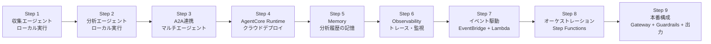
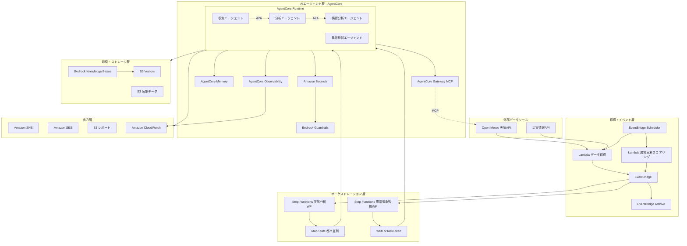

# 天気データ分析AIエージェント 要件定義書

**バージョン:** 0.1
**作成日:** 2026-03-21
**ステータス:** ✅ 承認済み

---

## 1. プロジェクト概要

### 1.1 背景と課題

AWS公式のAgentCoreワークショップ（Lab 1〜9）で、Strands Agents + Bedrock AgentCore を使ったAIエージェントシステムの構築手法を学んだ。しかし、ワークショップは各機能の個別学習が中心であり、本番レベルのアーキテクチャ（イベント駆動、マルチエージェント、オーケストレーション等）を統合的に学べる教材が不足している。

### 1.2 プロジェクトの目的

AgentCoreワークショップの学びを統合し、本番構成に近いマルチエージェントシステムを**段階的に（Step by Step）** 構築することで、以下を習得する:

- Strands Agents SDK によるエージェント開発
- AgentCore の各機能（Runtime, Memory, Gateway, Observability, Guardrails）
- イベント駆動アーキテクチャ（EventBridge + Lambda）
- ハイブリッドオーケストレーション（Step Functions + A2A）
- AWS CDK によるインフラのコード化

### 1.3 プロジェクト名

**天気データ分析AIエージェント**（Weather Analysis Agent）

### 1.4 スコープ

本要件定義の対象範囲:
- 天気・災害の外部データ取得
- 4つのAIエージェントによるデータ分析・異常検知
- AWS上でのデプロイ・運用基盤
- Step by Stepで各ステップが独立して動作確認可能な構成

### 1.5 学習ステップ構成

本プロジェクトは**9つのステップ**で段階的に構築する。各ステップは前のステップの成果物に積み上げる形だが、**各ステップ単体で動作確認が可能**。

### 1.6 システム構成図

構成図は `docs/designs/sample-architecture.drawio` を参照。
本番構成との対応は `docs/designs/architecture-comparison.md` を参照。

---

## 2. ドキュメント/データの分類

| データ種別 | 保存先 | 説明 |
|---|---|---|
| 気象データ（生データ） | S3 (気象データ保管) | Open-Meteo APIから取得した天気予報・過去データ |
| 災害情報 | S3 (気象データ保管) | 災害情報APIから取得した警報・注意報 |
| 分析レポート | S3 (レポート出力) | エージェントが生成した分析結果・グラフ |
| アラートログ | S3 (レポート出力) | 異常検知エージェントの出力ログ |
| ベクトルデータ | S3 Vectors | Knowledge Bases用の埋め込みベクトル |
| イベント | EventBridge Archive | 全イベントのアーカイブ |
| 記憶データ | AgentCore Memory | エージェントの短期・長期記憶 |
| 都市マスタ | 設定ファイル (cities.yaml) | 分析対象の都市一覧 |

---

## 3. 技術スタック

| レイヤー | 技術 | 備考 |
|---|---|---|
| AIエージェント | Strands Agents SDK (Python) | エージェント実行フレームワーク |
| LLM | Amazon Bedrock (Claude) | 推論・計画・判断 |
| エージェント基盤 | Amazon Bedrock AgentCore | Runtime, Memory, Gateway, Observability |
| オーケストレーション | AWS Step Functions | ワークフロー制御（Map State, waitForTaskToken） |
| イベント駆動 | Amazon EventBridge | イベントバス、Scheduler、Archive |
| データ取得 | AWS Lambda (Python) | 外部API呼び出し |
| ストレージ | Amazon S3, S3 Vectors | データ保管、ベクトルストア |
| 知識ベース | Bedrock Knowledge Bases | RAG用ナレッジベース |
| 安全性 | Bedrock Guardrails | エージェント出力のガードレール |
| 通知 | Amazon SNS, Amazon SES | アラート、メール通知 |
| 監視 | Amazon CloudWatch | トレース、メトリクス、ダッシュボード |
| インフラ | AWS CDK (TypeScript) | Infrastructure as Code |
| パッケージ管理 | uv (Python), npm (CDK) | |

---

## 4. 機能要件

### Step 1: 収集エージェント（ローカル実行）

**対応Lab:** Lab 1 (Code Interpreter)
**学習テーマ:** Strands Agents の基本、ツール定義、Bedrock連携

| 機能 | 説明 |
|---|---|
| 天気データ取得ツール | Open-Meteo APIから指定都市の天気予報・過去データを取得する |
| 災害情報取得ツール | 災害情報APIから警報・注意報を取得する |
| 収集エージェント | システムプロンプトに従い、ユーザーの指示に応じて適切なツールを選択・実行する |
| ローカル実行 | CLI経由でエージェントと対話し、データ取得結果を確認できる |

**動作確認:** ターミナルで「東京の1週間の天気を教えて」と入力し、天気データが返る。

---

### Step 2: 分析エージェント（ローカル実行）

**対応Lab:** Lab 1 (Code Interpreter)
**学習テーマ:** AgentCore Code Interpreter、複数ツールの連携

| 機能 | 説明 |
|---|---|
| データ分析ツール | AgentCore Code Interpreter でPython/pandas/NumPyを使った分析を実行する |
| S3保存ツール | 分析結果（テキスト・グラフ画像）をS3に保存する |
| 分析エージェント | 天気データを受け取り、統計分析・可視化・レポート生成を行う |
| ローカル実行 | CLI経由で分析エージェントと対話し、分析結果を確認できる |

**動作確認:** 天気データを渡して「週間トレンドを分析して」と入力し、グラフ付きレポートが生成される。

---

### Step 3: A2A連携（マルチエージェント）

**対応Lab:** (ワークショップ外 / 発展)
**学習テーマ:** Agent-to-Agent通信、マルチエージェント協調

| 機能 | 説明 |
|---|---|
| A2Aプロトコル実装 | 収集エージェント→分析エージェント間のA2A通信を実装する |
| 横断分析エージェント | 複数都市のデータを収集エージェントから受け取り、横断比較を行う |
| 異常検知エージェント | 気温急変・災害情報を検知し、アラート情報を生成する |
| エージェントチェーン | 4つのエージェントが連携して「収集→分析→横断分析」のパイプラインを実行する |

**動作確認:** 「東京・大阪・福岡の天気を比較分析して」と入力し、4エージェントが連携して横断分析レポートが生成される。

---

### Step 4: AgentCore Runtime（クラウドデプロイ）

**対応Lab:** Lab 2 (Runtime)
**学習テーマ:** AgentCore Runtime、CDKによるデプロイ、HTTPS エンドポイント

| 機能 | 説明 |
|---|---|
| CDK Runtimeスタック | AgentCore Runtime をCDKで構築する |
| エージェントデプロイ | `agentcore deploy` で4エージェントをRuntimeにデプロイする |
| HTTPSエンドポイント | デプロイ後に自動生成されるHTTPSエンドポイント経由でエージェントを呼び出せる |
| microVM隔離 | 各セッションがmicroVMで隔離されることを確認する |

**動作確認:** `curl` でHTTPSエンドポイントを呼び出し、ローカル実行と同じ結果が得られる。

---

### Step 5: Memory（分析履歴の記憶）

**対応Lab:** Lab 3 (Memory)
**学習テーマ:** AgentCore Memory、短期/長期記憶、セマンティック検索

| 機能 | 説明 |
|---|---|
| 短期記憶 | 会話内の分析結果をcreate_event()で保存する |
| Memory Strategy | 短期記憶から長期記憶への自動変換ルールを定義する |
| 長期記憶 | 過去の分析結果をretrieve_memories()でセマンティック検索する |
| 比較機能 | 過去の分析結果と最新データを比較し、変化を報告する |

**動作確認:** 「先週の分析と今週の東京の天気を比較して」と入力し、過去の記憶に基づいた比較レポートが返る。

---

### Step 6: Observability（トレース・監視）

**対応Lab:** Lab 4 (Observability)
**学習テーマ:** AgentCore Observability、CloudWatch、End-to-Endトレース

| 機能 | 説明 |
|---|---|
| トレース設定 | AgentCore Observability でOTelトレースを有効化する |
| CloudWatch連携 | CDKでCloudWatch Transaction Searchの設定を構築する |
| ダッシュボード | エージェントの呼び出し回数・レイテンシ・エラー率を可視化する |
| アラーム | エラー率が閾値を超えた場合にアラームを発報する |

**動作確認:** エージェントを実行後、CloudWatchコンソールでEnd-to-Endのトレースが確認できる。

---

### Step 7: イベント駆動（EventBridge + Lambda）

**対応Lab:** (ワークショップ外 / 本番構成パターン)
**学習テーマ:** EventBridge Scheduler、Lambda、イベント駆動アーキテクチャ

| 機能 | 説明 |
|---|---|
| EventBridge Scheduler | 定時（例: 毎日9:00 JST）でデータ取得Lambdaを起動する |
| Lambda データ取得 | Open-Meteo APIと災害情報APIからデータを取得し、EventBridgeにイベント発行する |
| Lambda 異常気象スコアリング | Bedrock APIを使い、取得データの異常度をスコアリングし、イベント発行する |
| EventBridge Archive | 全イベントをアーカイブする |

**動作確認:** Schedulerで定時実行後、EventBridgeコンソールでイベントが発行されていることを確認。手動でLambdaをテスト実行してイベント内容を検証。

---

### Step 8: オーケストレーション（Step Functions）

**対応Lab:** (ワークショップ外 / 本番構成パターン)
**学習テーマ:** Step Functions、Map State、waitForTaskToken、ハイブリッドオーケストレーション

| 機能 | 説明 |
|---|---|
| 天気分析ワークフロー | EventBridgeの気象データイベントをトリガーに、Step Functionsワークフローを起動する |
| Map State (都市並列) | 複数都市の分析を並列実行する（maxConcurrency=10） |
| 異常気象監視ワークフロー | 異常気象イベントをトリガーに、監視ワークフローを起動する |
| waitForTaskToken | 非同期でAgentCore Runtimeのジョブ完了を待機する（待機中は課金なし） |
| AgentCore連携 | Step FunctionsからAgentCore Runtimeに非同期ジョブを投入する |

**動作確認:** EventBridgeから手動イベントを発行し、Step Functionsコンソールで都市並列のワークフロー実行を確認。

---

### Step 9: 本番構成（Gateway + Guardrails + 出力）

**対応Lab:** Lab 6 (Identity), Lab 7 (Gateway), Lab 8 (Policy)
**学習テーマ:** AgentCore Gateway (MCP)、Guardrails、通知・レポート出力

| 機能 | 説明 |
|---|---|
| AgentCore Gateway (MCP) | 外部APIアクセスをMCPプロトコルで統一する |
| Bedrock Guardrails | エージェントの出力にガードレールを適用する（不適切な表現の検出等） |
| Bedrock Knowledge Bases | 気象用語や過去レポートをRAGで検索可能にする |
| SNS通知 | 異常気象検知時にSNSでアラート通知を送信する |
| SESメール | 日次分析レポートをメールで送信する |
| S3レポート出力 | 分析レポート（HTML/PDF）をS3に保存し、Pre-signed URLで共有する |

**動作確認:** 異常気象を検知した際にSNS通知が届き、日次レポートがS3に保存され、メールでURLが届く。

---

## 5. ストレージ設計（概要）

学習用サンプルのため、ストレージは **S3のみ** に簡略化する。
状態管理はStep FunctionsとAgentCore Runtimeに委ねる。

### S3バケット構成

| バケット用途 | パスパターン | 内容 |
|---|---|---|
| 気象データ保管 | `data/weather/{city}/{date}.json` | Open-Meteo APIから取得した生データ |
| 災害情報保管 | `data/disaster/{date}.json` | 災害情報APIから取得した警報・注意報 |
| 分析レポート | `reports/{date}/{city}/report.html` | エージェントが生成した分析結果・グラフ |
| アラートログ | `alerts/{date}/{alert-id}.json` | 異常検知エージェントが出力したアラート |

### 都市マスタ

分析対象の都市はPythonコード内の設定ファイル（`cities.yaml` 等）で管理する。

### 状態管理

| 状態 | 管理元 |
|---|---|
| ワークフロー実行状態 | Step Functions（自動管理） |
| エージェントセッション | AgentCore Runtime（自動管理） |
| 分析履歴・記憶 | AgentCore Memory |

---

## 6. 画面構成

本プロジェクトはCLI / API中心のバックエンドシステムであり、専用のUIは設けない。

| インターフェース | 概要 |
|---|---|
| CLI | ローカル開発時のエージェント対話（Step 1〜3） |
| HTTPS API | AgentCore Runtime のエンドポイント（Step 4以降） |
| CloudWatch Console | トレース・メトリクスの確認（Step 6） |
| Step Functions Console | ワークフロー実行状況の確認（Step 8） |
| S3 + Pre-signed URL | 生成レポートの閲覧（Step 9） |

---

## 7. セキュリティ要件

| 要件 | 説明 |
|---|---|
| IAMロール最小権限 | 各Lambda・AgentCoreに必要最小限のIAMポリシーを付与する |
| Bedrock Guardrails | エージェント出力のフィルタリング（PII検出、不適切コンテンツの抑止） |
| microVM隔離 | AgentCore RuntimeのmicroVMによるセッション間隔離 |
| S3暗号化 | S3バケットのサーバーサイド暗号化（SSE-S3） |

---

## 8. 対象外（本スコープでは実装しない）

- フロントエンドUI（Web画面、モバイルアプリ）
- ユーザー認証・認可（Cognito連携）-- 学習用のため省略
- マルチテナント対応
- 高可用性（マルチAZ構成）
- 本番データのバックアップ・リストア戦略
- CI/CDパイプライン
- コスト最適化（Reserved Instance等）
- ブラウザ操作エージェント（Lab 9 Browser Use）-- 発展課題として残す

---

## 付録: ステップとワークショップLabの対応

| ステップ | 対応Lab | AgentCore機能 | AWS サービス |
|---|---|---|---|
| Step 1 | Lab 1 | - | Bedrock |
| Step 2 | Lab 1 | Code Interpreter | Bedrock, S3 |
| Step 3 | - | A2A | Bedrock |
| Step 4 | Lab 2 | Runtime | Bedrock, CDK |
| Step 5 | Lab 3 | Memory | Bedrock |
| Step 6 | Lab 4 | Observability | CloudWatch, CDK |
| Step 7 | - | - | EventBridge, Lambda, CDK |
| Step 8 | - | - | Step Functions, CDK |
| Step 9 | Lab 6,7,8 | Gateway, Guardrails | SNS, SES, S3, Knowledge Bases, CDK |
