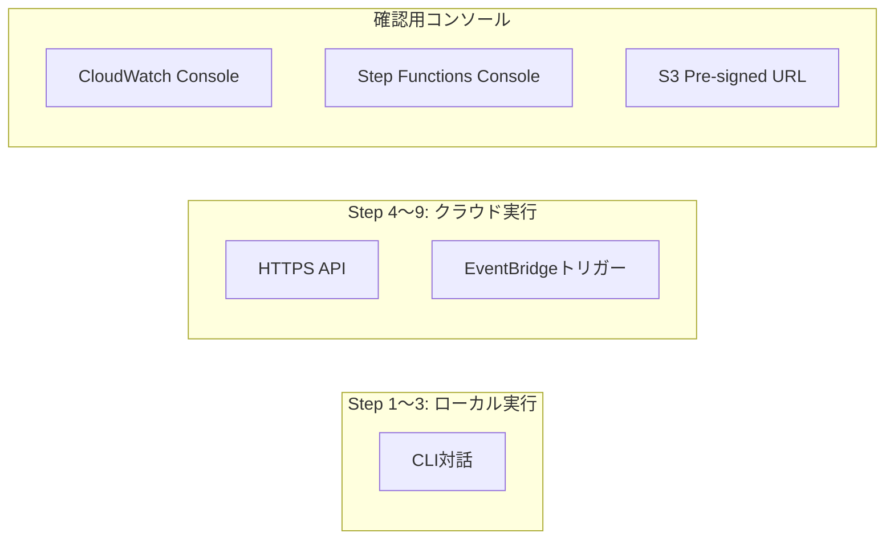
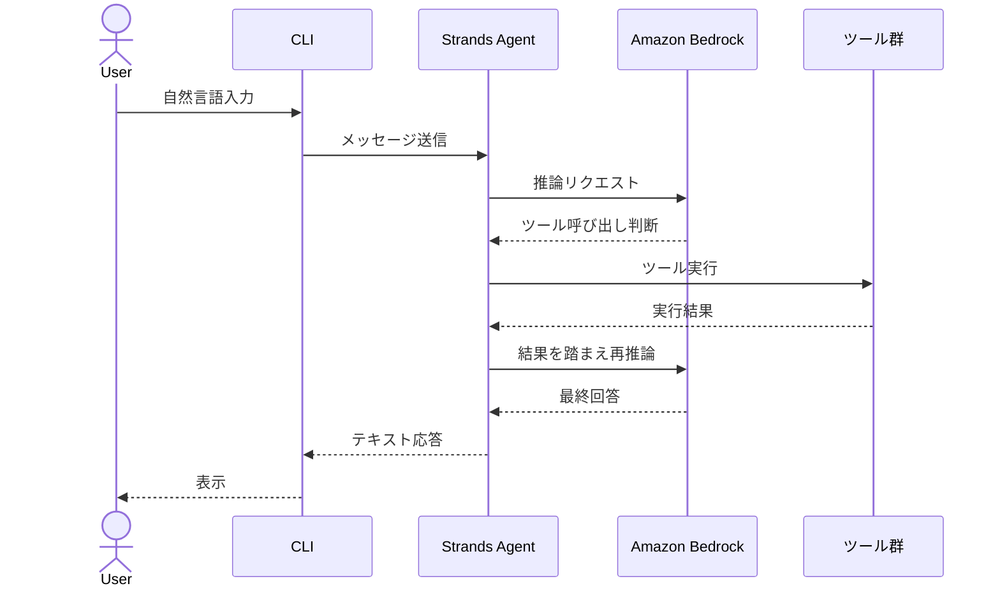
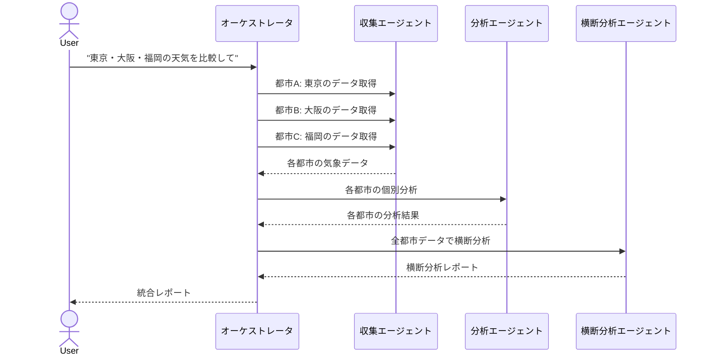
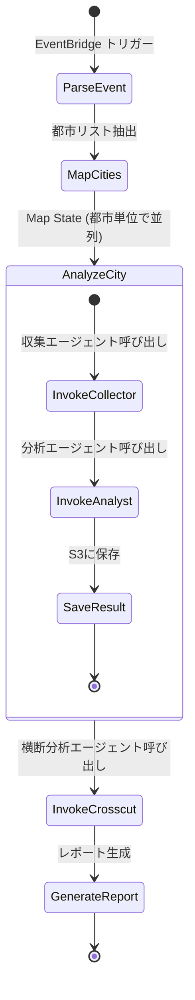
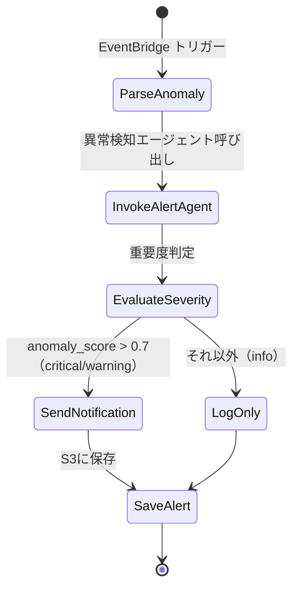

# 天気データ分析AIエージェント 仕様書

**要件定義書:** [weather-agent-requirements.md](../requirements/weather-agent-requirements.md)
**作成日:** 2026-03-21
**ステータス:** ✅ 承認済み

---

## 1. インターフェース仕様

本システムはCLI / API中心のバックエンドシステムであり、画面UIは持たない。

### インターフェース一覧



### 1.1 CLI インターフェース（Step 1〜3）

> **学習ポイント（Lab 1 対応）:**
> Strands Agents SDK の対話ループの仕組みを理解する。
>
> **実装で学ぶこと:**
> - `Agent` クラスの初期化（`system_prompt` と `tools` の渡し方）
> - `@tool` デコレータによるツール関数の定義
> - `agent("ユーザー入力")` で推論〜ツール実行〜回答生成が自動で回る仕組み
> - `packages/agents/collector/src/agent.py` にエージェント定義、`tools/` 配下にツール関数を配置する構成

| 項目 | 内容 |
|---|---|
| 起動コマンド | `uv run python -m agents.collector` (Step 1) |
| | `uv run python -m agents.analyst` (Step 2) |
| | `uv run python -m agents.orchestrator` (Step 3) |
| 入力形式 | 自然言語テキスト（標準入力） |
| 出力形式 | テキスト + 画像パス（標準出力） |
| 終了 | `exit` または `Ctrl+C` |

#### CLI対話フロー



### 1.2 HTTPS API（Step 4以降）

> **学習ポイント（Lab 2 対応）:**
> AgentCore Runtime のHTTPSエンドポイントの仕組み。ローカル実行のコードをほぼ変更せずにクラウドデプロイできることがRuntime の価値。
>
> **実装で学ぶこと:**
> - `agentcore deploy` コマンドでエージェントコードをRuntimeにデプロイする手順
> - `invoke_agent()` API によるHTTPS経由のエージェント呼び出し
> - `packages/infra/lib/runtime-stack.ts` にCDKでRuntime定義を記述
> - ローカル実行時の `agent("入力")` とAPI経由の `invoke_agent()` でエージェントコード自体は共通

| 項目 | 内容 |
|---|---|
| プロトコル | HTTPS |
| エンドポイント | AgentCore Runtime が自動生成（`agentcore deploy` 時に払い出し） |
| 認証 | IAM Signature V4（学習用のため簡易構成） |
| リクエスト形式 | `invoke_agent()` API |
| レスポンス形式 | ストリーミングテキスト |

#### API呼び出し例

```python
# invoke_agent() の呼び出し例
from agentcore import AgentCoreClient

client = AgentCoreClient(endpoint_url="https://<auto-generated>.agentcore.aws")
response = client.invoke_agent(
    agent_name="collector",
    message="東京の1週間の天気を教えて",
    session_id="session-001"  # microVM隔離の単位
)
```

---

## 2. エージェント仕様

### 2.1 収集エージェント（Step 1）

> **学習ポイント（Lab 1 対応）:**
> Strands Agents の基本構造を理解する。エージェント = システムプロンプト + ツール群 + LLM。
>
> **実装で学ぶこと:**
> - `from strands import Agent, tool` でSDKをインポート
> - `@tool` で `get_weather()` / `get_disaster_info()` を定義し、引数の型ヒントがそのままツールのパラメータスキーマになる仕組み
> - `Agent(system_prompt=..., tools=[get_weather, get_disaster_info])` でエージェントを組み立てる
> - Open-Meteo API は `httpx` で呼び出し、都市名→緯度経度の変換は Geocoding API を使う

#### システムプロンプト

```
あなたは気象データ収集の専門家です。
ユーザーの指示に基づいて、天気データや災害情報を取得し、わかりやすく整理して報告します。

利用可能なツール:
- get_weather: 指定都市の天気予報・過去データを取得
- get_disaster_info: 災害警報・注意報を取得

回答のルール:
- データは必ずツールを使って取得すること（推測しない）
- 取得したデータは表形式で見やすく整理すること
- 温度は摂氏、風速はm/sで表示すること
```

#### ツール定義

**get_weather**

| 項目 | 内容 |
|---|---|
| 説明 | Open-Meteo APIから指定都市の天気データを取得する |
| 入力 | `city: str` - 都市名（日本語可） |
| | `days: int` - 取得日数（1〜16、デフォルト: 7） |
| | `data_type: str` - "forecast" or "historical"（デフォルト: "forecast"） |
| 出力 | JSON形式の気象データ（気温、降水量、風速、天気コード等） |
| 外部API | Open-Meteo API (`https://api.open-meteo.com/v1/forecast`) |
| エラー時 | 都市名の解決失敗 → "都市名を確認してください" メッセージを返す |
| | API通信エラー → リトライ1回、失敗時はエラーメッセージを返す |

**get_disaster_info**

| 項目 | 内容 |
|---|---|
| 説明 | 災害情報APIから警報・注意報を取得する |
| 入力 | `region: str` - 地域名（省略時は全国） |
| 出力 | JSON形式の災害情報（警報種別、発表時刻、対象地域等） |
| 外部API | 要確認（気象庁XML or 代替の無料API） |
| エラー時 | 情報なし → "現在発表中の警報・注意報はありません" を返す |

#### 入出力例

```
入力: 東京の1週間の天気を教えて

出力:
🌤 東京の週間天気予報（2026-03-21〜2026-03-27）

| 日付 | 天気 | 最高気温 | 最低気温 | 降水量 | 風速 |
|------|------|---------|---------|--------|------|
| 3/21 | 晴れ | 18°C | 8°C | 0mm | 3m/s |
| 3/22 | 曇り | 16°C | 9°C | 0mm | 4m/s |
| ... | ... | ... | ... | ... | ... |
```

---

### 2.2 分析エージェント（Step 2）

> **学習ポイント（Lab 1 対応）:**
> AgentCore Code Interpreter を使うと、エージェントがPythonコードを動的に生成・実行できる。サンドボックス環境でpandas/NumPy/matplotlib等が利用可能。
>
> **実装で学ぶこと:**
> - `from strands_tools.code_interpreter import AgentCoreCodeInterpreter` でCode Interpreterをインポート
> - インスタンス化して `.code_interpreter` 属性をツールとして渡すと、LLMが必要に応じてPythonコードを生成・実行する
> - `save_to_s3` は自作ツール。`boto3` の `s3.put_object()` をラップする
> - `packages/agents/analyst/src/agent.py` にエージェント定義、`tools/save_to_s3.py` にS3保存ツールを配置

#### システムプロンプト

```
あなたは気象データ分析の専門家です。
天気データを受け取り、統計分析・可視化・レポート生成を行います。

利用可能なツール:
- code_interpreter: Pythonコードを実行して分析・グラフ生成
- save_to_s3: 分析結果をS3に保存

分析のルール:
- データ分析にはpandas、NumPyを使用すること
- グラフ生成にはmatplotlibを使用すること
- 分析結果は必ず「要約」「詳細」「グラフ」の3部構成にすること
- グラフの日本語表示にはjapanize-matplotlibを使用すること
```

#### ツール定義

**code_interpreter**

| 項目 | 内容 |
|---|---|
| 説明 | AgentCore Code Interpreter でPythonコードを実行する |
| 実行環境 | AgentCore サンドボックス（Python, pandas, NumPy, matplotlib） |
| 入力 | `code: str` - 実行するPythonコード |
| 出力 | テキスト出力 + 生成ファイル（画像等） |
| 制約 | ネットワークアクセス不可（サンドボックス内で完結） |

> **本番構成との違い:** 本番ではCode InterpreterでS&Pの財務データを分析するが、サンプルでは気象データの統計分析を行う。分析パターン（時系列分析・比較分析）は共通。

**save_to_s3**

| 項目 | 内容 |
|---|---|
| 説明 | 分析結果をS3バケットに保存する |
| 入力 | `content: str` - 保存するテキスト or ファイルパス |
| | `s3_key: str` - S3のキー（パスパターンに従う） |
| | `content_type: str` - MIMEタイプ（デフォルト: "application/json"） |
| 出力 | 保存先のS3 URI |

---

### 2.3 横断分析エージェント（Step 3）

> **学習ポイント（ワークショップ外 / 発展）:**
> A2A（Agent-to-Agent）通信で、エージェント間の協調を実現する。1つのエージェントが全部やるのではなく、専門性で分離するのがマルチエージェントの設計思想。
>
> **実装で学ぶこと:**
> - Strands Agents の `Agent` をツールとして別の `Agent` に渡すことでA2A連携を実現する
> - オーケストレータ（`packages/agents/orchestrator/`）が各エージェントを呼び分ける
> - 横断分析エージェントは複数都市の結果をまとめて受け取り、比較分析を行うため、入力データのスキーマ設計が重要
> - `packages/agents/crosscut/src/agent.py` と `packages/agents/alert/src/agent.py` を新規作成

#### システムプロンプト

```
あなたは複数都市の気象データを横断的に比較分析する専門家です。
各都市の分析結果を受け取り、都市間の比較・相関分析・トレンド比較を行います。

利用可能なツール:
- code_interpreter: 横断分析のPythonコード実行
- save_to_s3: 横断分析レポートの保存

分析のルール:
- 最低2都市以上のデータを比較すること
- 都市間の差異を明確に示すこと
- 共通トレンドと個別傾向を分離して報告すること
```

#### A2A通信仕様



---

### 2.4 異常検知エージェント（Step 3）

> **学習ポイント（ワークショップ外 / 発展）:**
> 本番構成の「シグナル検知エージェント」に対応。イベント駆動で起動されるエージェントの設計パターンを学ぶ。
>
> **実装で学ぶこと:**
> - 異常検知のルール（閾値ベース）をシステムプロンプトで定義し、LLMが柔軟に判断する設計
> - アラート出力をJSON形式で構造化し、後続のSNS通知やS3保存に連携しやすくする
> - Step 7以降ではEventBridgeイベントをトリガーにこのエージェントが自動起動される

#### システムプロンプト

```
あなたは気象異常を検知する監視エージェントです。
気象データを監視し、急激な変化や危険な状況を検知してアラートを生成します。

検知ルール:
- 24時間以内の気温変化が10°C以上 → 急激な気温変化アラート
- 風速が15m/s以上 → 強風アラート
- 降水量が50mm/h以上 → 大雨アラート
- 災害警報が発表中 → 災害アラート

アラートは重要度（critical / warning / info）を付与すること。
```

#### アラート出力フォーマット

```json
{
  "alert_id": "alert-20260321-001",
  "timestamp": "2026-03-21T09:00:00+09:00",
  "city": "東京",
  "type": "temperature_change",
  "severity": "warning",
  "message": "東京で24時間以内に12°Cの気温低下を検知しました",
  "data": {
    "previous_temp": 22,
    "current_temp": 10,
    "change": -12
  }
}
```

---

## 3. 外部API仕様

### 3.1 Open-Meteo API

> **学習ポイント:**
> 本番構成では S&P Global MCP Server を使用するが、サンプルではAPIキー不要のOpen-Meteoを使用。ツールの差し替えが容易なのがエージェント設計の利点。
>
> **実装で学ぶこと:**
> - `httpx.AsyncClient` で非同期HTTPリクエストを送信する実装パターン
> - APIレスポンスのパースと、エージェントが扱いやすい形式（辞書型）への変換
> - Step 9 で AgentCore Gateway (MCP) を導入すると、このツールの実装を MCP プロトコルに置き換えられる

| 項目 | 内容 |
|---|---|
| ベースURL | `https://api.open-meteo.com/v1/forecast` |
| 認証 | 不要（無料API） |
| レート制限 | 10,000リクエスト/日 |

#### リクエスト例（天気予報）

```
GET https://api.open-meteo.com/v1/forecast
  ?latitude=35.6762
  &longitude=139.6503
  &daily=temperature_2m_max,temperature_2m_min,precipitation_sum,wind_speed_10m_max,weather_code
  &timezone=Asia/Tokyo
  &forecast_days=7
```

#### レスポンス例

```json
{
  "daily": {
    "time": ["2026-03-21", "2026-03-22", "..."],
    "temperature_2m_max": [18.2, 16.5, "..."],
    "temperature_2m_min": [8.1, 9.3, "..."],
    "precipitation_sum": [0.0, 0.0, "..."],
    "wind_speed_10m_max": [12.5, 15.2, "..."],
    "weather_code": [1, 3, "..."]
  }
}
```

#### 都市名 → 緯度経度の解決

Open-Meteo Geocoding API を使用:

```
GET https://geocoding-api.open-meteo.com/v1/search?name=東京&count=1&language=ja
```

### 3.2 災害情報API

| 項目 | 内容 |
|---|---|
| 候補1 | 気象庁 防災情報XML（`https://www.data.jma.go.jp/developer/xml/feed/`） |
| 候補2 | Yahoo!天気災害API（要確認） |
| 認証 | 不要（候補1の場合） |

> **要確認:** 災害情報APIの具体的なエンドポイントは実装時に確定する。気象庁XMLが利用可能であればそれを優先する。

---

## 4. データモデル

### 4.1 S3バケット構成

> **学習ポイント:**
> 本番構成ではRDS/DynamoDBも使用するが、サンプルではS3のみに簡略化。S3のパスパターン設計がデータ管理の鍵。
>
> **実装で学ぶこと:**
> - `boto3` の `s3.put_object()` / `s3.get_object()` でデータの読み書きを行う
> - パスパターン `{category}/{city}/{date}.json` で日付・都市ごとに整理し、後からの検索を容易にする
> - CDKでは `new s3.Bucket()` でバケットを作成し、暗号化・ライフサイクルポリシーを設定する

```
weather-agent-{account-id}-{region}/
├── data/
│   ├── weather/
│   │   └── {city}/
│   │       └── {YYYY-MM-DD}.json        # 気象データ（生データ）
│   └── disaster/
│       └── {YYYY-MM-DD}.json            # 災害情報
├── reports/
│   └── {YYYY-MM-DD}/
│       ├── {city}/
│       │   ├── report.html              # 個別都市分析レポート
│       │   └── charts/
│       │       └── *.png                # グラフ画像
│       └── crosscut/
│           └── report.html              # 横断分析レポート
└── alerts/
    └── {YYYY-MM-DD}/
        └── {alert-id}.json             # アラートログ
```

### 4.2 都市マスタ（cities.yaml）

```yaml
cities:
  - name: 東京
    name_en: Tokyo
    latitude: 35.6762
    longitude: 139.6503
    timezone: Asia/Tokyo
  - name: 大阪
    name_en: Osaka
    latitude: 34.6937
    longitude: 135.5023
    timezone: Asia/Tokyo
  - name: 福岡
    name_en: Fukuoka
    latitude: 33.5904
    longitude: 130.4017
    timezone: Asia/Tokyo
```

### 4.3 EventBridge イベントスキーマ（Step 7）

> **学習ポイント（Step 7 対応）:**
> イベント駆動アーキテクチャでは、イベントのスキーマ設計が重要。EventBridgeのルールでイベントをフィルタリングし、適切なワークフローにルーティングする。
>
> **実装で学ぶこと:**
> - Lambda内で `boto3` の `events.put_events()` を使ってイベントを発行する
> - CDKで `new events.Rule()` を作成し、`detail-type` でイベントをフィルタリングしてStep Functionsにルーティングする
> - EventBridge Archive は CDK の `new events.Archive()` で作成。全イベントを自動保存する

#### 気象データ取得完了イベント

```json
{
  "source": "weather-agent.ingest",
  "detail-type": "WeatherDataFetched",
  "detail": {
    "cities": ["東京", "大阪", "福岡"],
    "date": "2026-03-21",
    "s3_keys": [
      "data/weather/東京/2026-03-21.json",
      "data/weather/大阪/2026-03-21.json",
      "data/weather/福岡/2026-03-21.json"
    ]
  }
}
```

#### 異常気象検知イベント

<!-- implement: 2026-03-22 TASK-011 スコア閾値を明記 -->
scorer Lambda が算出した `anomaly_score` が **0.7 を超えた場合** に発行される。

```json
{
  "source": "weather-agent.scorer",
  "detail-type": "WeatherAnomalyDetected",
  "detail": {
    "city": "東京",
    "anomaly_score": 0.85,
    "anomaly_type": "temperature_change",
    "data": {
      "previous_temp": 22,
      "current_temp": 10
    }
  }
}
```

### 4.4 Step Functions ステートマシン定義（Step 8）

> **学習ポイント（Step 8 対応）:**
> ハイブリッドオーケストレーション = 外側をStep Functions（決定的制御）、内側をAgentCore A2A（LLM動的判断）で構成する。本番構成の設計パターンそのもの。
>
> **実装で学ぶこと:**
> - CDK の `new sfn.StateMachine()` でワークフローを定義する
> - `sfn.Map` で都市リストを並列実行し、`maxConcurrency` で同時実行数を制御する
> - `sfn.TaskToken` を使った非同期待機パターン: Lambda → AgentCore Runtime にジョブ投入 → コールバックで完了通知
> - Step Functions の ASL（Amazon States Language）をCDKの高水準API で記述する方法

#### 天気分析ワークフロー



#### 異常気象監視ワークフロー

<!-- implement: 2026-03-22 TASK-013 サンプル実装の簡略化を反映、分岐条件を明記 -->



> **サンプル実装の簡略化:**
> - 本番では InvokeAlertAgent と EvaluateSeverity の間に `waitForTaskToken` による非同期待機ステップが入るが、サンプルでは Pass ステートで簡略化している
> - 本番では SendNotification で SNS/SES 通知を送るが、サンプルでは Pass ステート（TASK-014 で接続予定）
> - EvaluateSeverity の分岐条件: `anomaly_score > 0.9` → critical、`anomaly_score > 0.7` → warning、それ以外 → info

---

## 5. CDKスタック構成（Step 4〜9）

> **学習ポイント:**
> CDKで段階的にスタックを追加することで、インフラもStep by Stepで学べる。
>
> **実装で学ぶこと:**
> - 各スタックは `packages/infra/lib/` 配下に個別ファイルとして作成する
> - スタック間の依存は `stack.addDependency()` で明示する
> - `cdk deploy StorageStack` のように個別デプロイが可能。学習ステップごとに必要なスタックだけデプロイする

| スタック | 導入Step | リソース |
|---|---|---|
| `StorageStack` | Step 2 | S3バケット |
| `RuntimeStack` | Step 4 | AgentCore Runtime |
| `MemoryStack` | Step 5 | AgentCore Memory |
| `ObservabilityStack` | Step 6 | CloudWatch ダッシュボード、アラーム |
| `EventStack` | Step 7 | EventBridge (Scheduler, Bus, Archive), Lambda x2 |
| `OrchestrationStack` | Step 8 | Step Functions (天気分析WF, 異常気象監視WF) |
| `GatewayStack` | Step 9 | AgentCore Gateway, Guardrails, Knowledge Bases, SNS, SES |

---

## 6. エラーハンドリング

| 状況 | 対処 |
|---|---|
| Open-Meteo API タイムアウト | 5秒タイムアウト、1回リトライ。失敗時はエラーメッセージをユーザーに返す |
| 都市名解決失敗 | Geocoding APIで0件 → "都市名を確認してください" メッセージ |
| Bedrock スロットリング | Strands SDK の自動リトライに委ねる（exponential backoff） |
| Code Interpreter 実行エラー | エラーメッセージをエージェントに返し、コード修正を試みる（最大3回） |
| S3保存失敗 | エラーログ出力、ユーザーにエラー通知 |
| Step Functions タイムアウト | 非同期ジョブ: 1時間でタイムアウト（AgentCore制約の8時間以内） |
| Lambda タイムアウト | 30秒タイムアウト（API呼び出し + 軽量処理に十分） |

---

## 7. 要確認事項

| # | 項目 | 内容 | 影響Step |
|---|---|---|---|
| 1 | 災害情報API | 気象庁XMLの具体的なエンドポイントとパース方法を実装時に確定する | Step 1 |
| 2 | AgentCore SDKバージョン | Strands Agents SDK と AgentCore SDK の最新バージョン・互換性を確認する | Step 1 |
| 3 | Code Interpreter利用料金 | AgentCore Code Interpreter の料金体系を確認し、学習用途での妥当性を判断する | Step 2 |
| 4 | A2A通信プロトコル | Strands Agents SDK でのA2A実装パターン（直接呼び出し or メッセージキュー）を確定する | Step 3 |
| 5 | AgentCore Runtimeリージョン | AgentCore Runtime が利用可能なリージョンを確認する | Step 4 |
